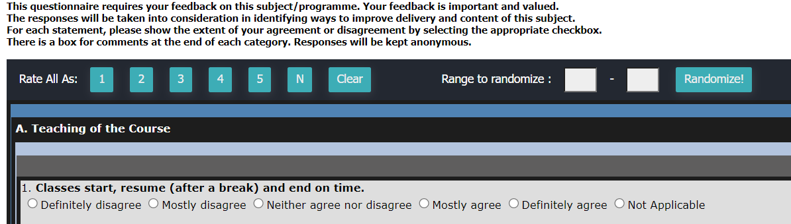
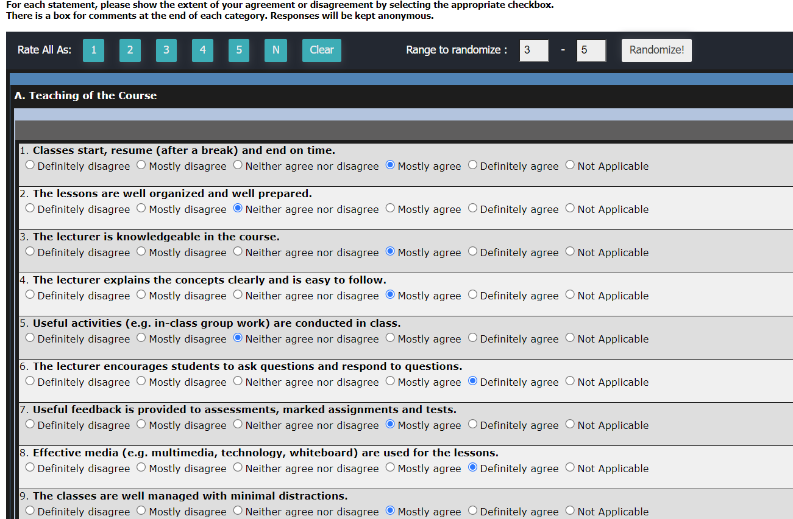

# QuickUOWSurvey
A simple script that adds a bar tool that lets you quickly finish UOWKDU's teaching survey in less than a minute. Normally
such a survey wouldn't take too long manually either, or so I thought. Surely I'm not the only one experienceing the constant
page refresh everytime you click on the option which is annoying! Hence this tool was made.

## Features
- Rate all as Absolutely Disagree to Non-applicable (Shows as 1 to N in the same order).
- Pick min max numbers between 1 to 6 to randomize between.
- Could bypass answered/locked surveys... I'm not responsible for your actions!

## Installation (Around 2 Min only)
1. Install a userscript manager like [Tampermonkey](https://www.tampermonkey.net/) (A chrome extensioon)
2. Click on [this](https://github.com/HageFX-78/QuickUOWSurvey/raw/main/surveyQuickSelect.user.js) and install.
3. Visit the survey page and it will be there.
4. Enjoy!

### Feel free to create an issue

### How the bar looks like:

### Random range select feature:

